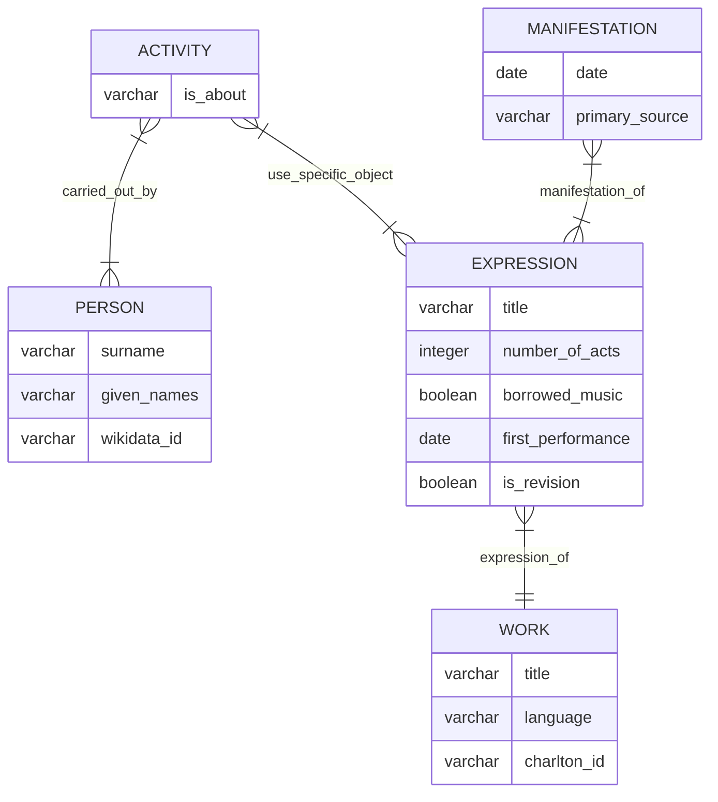

# opera-comique-revivals

Explorative data visualizations about revivals at the Opéra-Comique in the nineteenth century (with a focus on orchestration)

## Data architecture

### PERSON

An individual actor who created something.

|id| surname | given_names | wikidata_id |
|--|---|---|---|
|unique ID |last name|first name(s)|ID of person in WikiData database, if available|

### ACTION

A creative action involving an individual (Person) and which produced an expression of a work.

|id|involved|resulted_in|as_librettist|as_composer|as_orchestrator|
|--|--|--|--|--|--|
|unique ID|unique ID of the person who created something|unique ID of the expression of a work that the person helped create|whether the person's creative action was to write lyrics and/or dialogue for the expression of a work|whether the person's creative action was to write music for the expression of a work|whether the person's creative action was to orchestrate music |

### EXPRESSION

An expression of a work. Typically, there is but one expression of a work, and so this concept is confounded with work. It includes original works, created by authors, as well as revisions of those works.

|id| title | number_of_acts | borrowed_music | first_performance | charlton_id |
|--|---|---|---|---|---|
|unique ID|title according to Charlton and Wild dictionary (2005)| count of acts | whether the work has borrowed music, i.e. vaudevilles | date of the first performance, regardless of context, i.e. public and private | ID of the entry in Charlton and Wild's dictionary (2005)|

### MANIFESTATION

The performance or manifestation at a certain place and time of a creative work (Production).

|id|date|work_performed|place|primary_source|
|--|--|--|--|--|
|unique ID|date of the performance|work performed on this day|place|primary source attesting to the performance|
