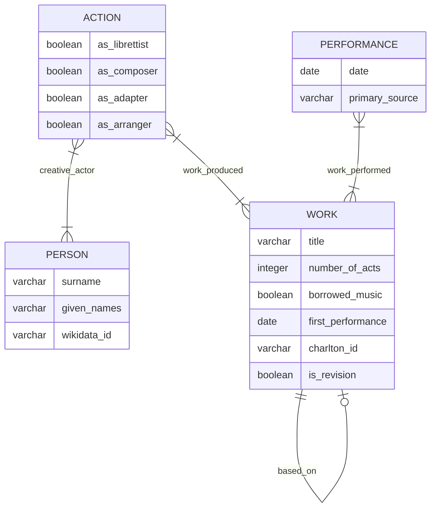

# opera-comique-revivals

Explorative data visualizations about revivals at the Opéra-Comique in the nineteenth century (with a focus on orchestration)

## Data architecture

### Person

|id| surname | given_names | wikidata_id |
|--|---|---|---|
|unique ID |last name|first name(s)|ID of person in WikiData database, if available|

### Work

|id| title | based_on | number_of_acts | borrowed_music | first_performance | charlton_id | is_revision |
|--|---|---|---|---|---|---|---|
|unique ID|title according to Charlton and Wild dictionary (2005)| unique ID of the work on which this work is based, according to Charlton and Wild's dictionary | count of work's acts | whether the work has borrowed music, i.e. vaudevilles | date of the first performance, regardless of context, i.e. public and private | ID of the entry in Charlton and Wild's dictionary (2005)| whether the work is a revised version of a work |

### Action

|id|creative_actor|work_produced|as_librettist|as_composer|as_adapter|as_arranger|
|--|--|--|--|--|--|--|
|unique ID|unique ID of the person who created something|unique ID of the work to which the person contributed|whether the person's creative action was to write lyrics and/or dialogue for a new work|whether the person's creative action was to write music for a new work|whether the person's creative action was to rewrite lyrics and/or dialogue for a revised work|whether the person's creative action was to rewrite music for a revised work|

### Performance

|id|date|work_performed|primary_source|
|--|--|--|--|
|unique ID|date of the performance|work performed on this day|primary source attesting to the performance|
