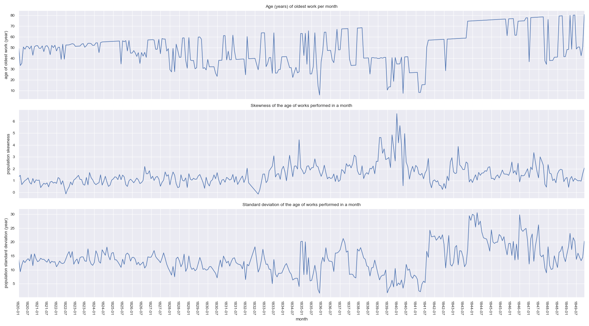
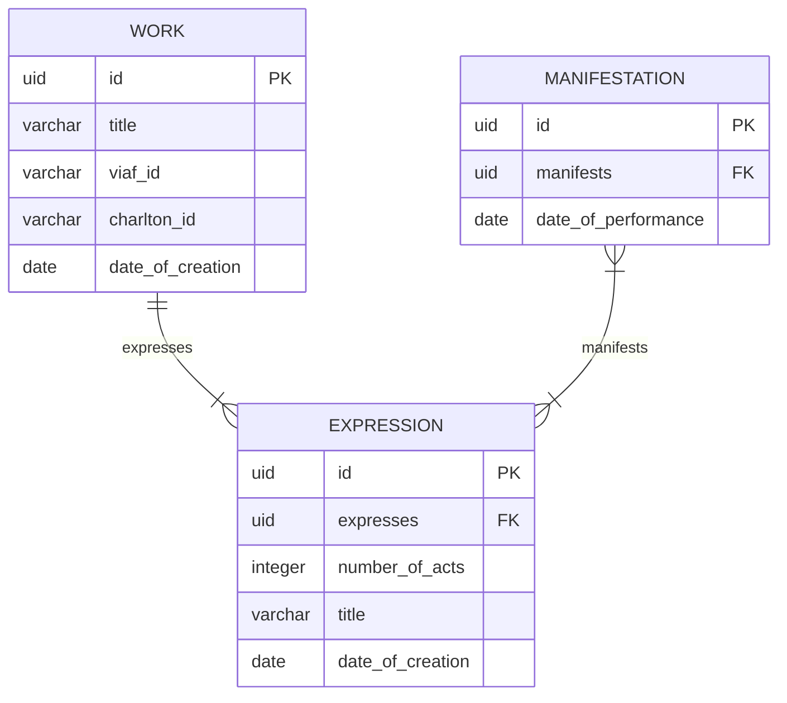

# opera-comique-revivals

Explorative data visualizations about revivals at the Opéra-Comique in the nineteenth century (with a focus on orchestration).

> Note: Preliminary analyses suggest the age / canonization of pieces mounted each month became less stable after 1830, as the skewness and stardard deviation of the works' ages changed.

## Data Architecture

The WEMI (Work, Expression, Manifestation, Item) model is adopted in order to align the data recorded in this project with the international scholarly community's F.A.I.R. principles: Findable, Accesible, Interoperable, and Reusable.

---

### Core Entities

Only a selection of attributes are shown below.

### Work

"An abstract notion of an artistic or intellectual creation." ([Dublin Core](https://ns.dublincore.org/openwemi/Work))

The conceptuatlization of an original opera, on which are based reorchestrations. Every **Work** has at least one **Expression**, its global premiere. In the ontology of this project's model, an **Expression** that has changed the genre and/or language of the **Work** on which it is based is an expression of a new **Work**. Reorchestrations, however, in which the genre and language are kept the same, do not constitute a new **Work**.

### Expression

"A perceivable form of the creation." ([Dublin Core](https://ns.dublincore.org/openwemi/Expression))

The realization of an operatic work in some finalized form. Every **Work** is expressed by an **Expression**, the first of which is considered "authoritative." Multiple **Expressions** can express the same **Work**, thus involving new actors in the creative realization of the core **Work**. In this project's ontology, all **Expressions** of a **Work** must have the same language and genre, as in the case of reorchestration or revision. Musicologists sometimes call such subsequent **Expressions** "works" in their own right, but in the WEMI model, derivative **Expressions**, along with the "authoritative" **Expression** of the original work, are of the ontological type **Expression.**

### Manifestation

"The physical embodiment of a creation." ([Dublin Core](https://ns.dublincore.org/openwemi/Manifestation))

In the case of opera, the temporal event in which the **Expression** was manifest before an audience, also known as the performance.
