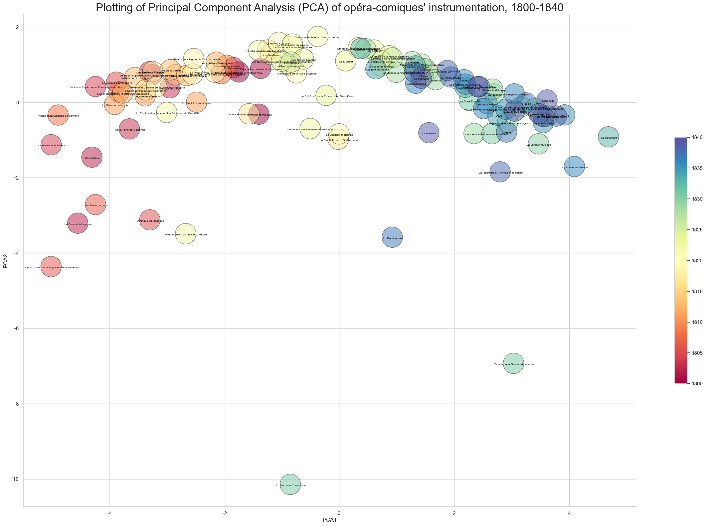

# Analysis of opéra-comique corpus, 1800-1840

A Principal Component Analysis (PCA) on the deployment of different instruments throughout an opera shows a gradual shift in required performing forces between 1800 and 1840.

Using PCA, we observe each opera in the corpus and assess the proportion of numbers (arias, overtures, interludes, etc.) in which each instrument was deployed. Violons and violas, for example, were used in every number of every opera in the corpus. Therefore, as seen in the heatmap at the bottom of the figure below, they are both highly correlated with one of the principal components and hardly correlated at all (0.02 and 0.07) with the other, meaning the presence of violons and violas is not a significant factor in the analysis. Trombones, trumpets, and timpani, on the other hand, are significant in both principal components of the analysis, both negatively (magenta) and positively (purple) influencing the PCA. Therefore, we can conclude that these dimensions, low brass and percussion, have significant deviations in the corpus.

When we plot the operas according to their PCA values (PCA1, PCA2), we see clusters form according to the opera's year of composition, which is indicated by color. This is interesting because the year of composition is not part of the PCA; it is a completely independent variable. As such, we can conclude that patterns in opera orchestration, which the PCA explores, are correlated with time. In other words, orchestration changes over time. (This is what we predicted in our hypothesis and, in on its own, isn't surprising at all.)

Operas composed between 1815 and 1825, shown in yellow, are less predicatbly positioned in the PCA visualization. Sometimes works composed during this transition period cluster with those of the previous decade. Such is the case of _Le Pavillon de fleurs_ (1822), _Les Rivaux de village_ (1819), and _Corisandre ou la Rose magique_ (1820). Sometimes they do not share many traits with operas on either end of the temporal spectrum, as seen with the yellow cluster at the center of the graph. Further inspection of these works, largely from 1817 to 1823, shows that the reason they differ is because they tended to deploy trumpets, which is different than older operas, but not trombones, which is different than later operas.

While most of the operas composed after 1830 are tightly grouped together in a shared, almost standardized instrumentation (blue-green cluster), there are several notable outliers that differ both from previous models and contemporary works: _Le Domino Noir_ (1837), _Zampa_ (1831), and _Le morceau d'ensemble_ (1831). These outliers suggest that the 1830s presented significantly innovative experimentations in orchestration not tested earlier in the century.
